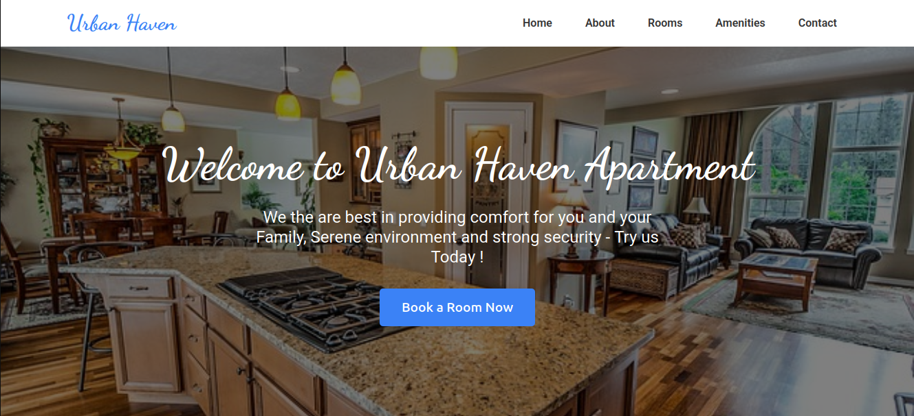

# Urban Haven Apartments - Landing Page

 

A responsive landing page for Urban Haven Apartments built with pure HTML and CSS, showcasing modern frontend development techniques.

## Features

- **Fully Responsive Design**: Adapts to all screen sizes
- **Modern UI Components**: 
  - Amenities showcase with hover effects
  - Contact form with validation
  - Interactive navigation
- **Performance Optimized**: Lightweight and fast-loading
- **Accessibility Focused**: Semantic HTML and ARIA labels

## Technologies Used


## Screenshots

| Mobile View | Desktop View |
|-------------|--------------|
|  |  |

## Installation

No dependencies required! Simply:

1. Clone the repository:
   ```bash
   git clone https://github.com/maunducyrus/urban-haven.git
   ```
2. Open `index.html` in your browser

## How to Customize

1. **Replace Images**:
   - Add your images to `/images` folder
   - Update paths in HTML/CSS files

2. **Change Colors**:
   Modify CSS variables in `:root`:
   ```css
   :root {
     --primary-color: #3b82f6; /* Change to your brand color */
   }
   ```

## Lessons Learned

While building this project, I:
- Mastered CSS Flexbox and Grid layouts
- Implemented responsive design principles
- Created accessible web forms
- Optimized image loading

## License

MIT License - Feel free to use as a template for your own projects!
